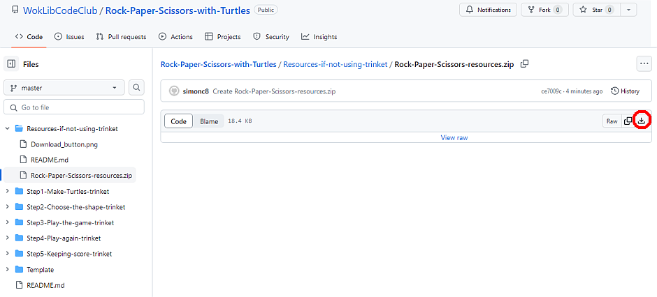

# Procedure for coding Rock, Paper Scissors using turtles if not using trinket

This page outlines how to download the resources necessary for this project, and also covers **Step 1** of the project for those not using trinket, as the coding is very slightly different. At the end of Step 1 the project path is exactly the same as for trinket.

## Downloading the resources

Firstly, ***make a new folder for this project***. You will keep all the resources and code in this folder.

You will have to download a zip file which contains a Python file with some starter code already added, and eight ```.gif``` image files to be used with Python turtles.

The link to the zip file is below, but when you click the link you will see a page like this:



Click on the *Download* icon (circled in red) and choose a location to save the zip file. After you have saved the file come back to this page.

The link to the resources zip file is [here](Rock-Paper-Scissors-resources.zip)

You should now extract all the files in the zip file and put them in your project folder.

Open the file ```rock-paper-scissors-with-turtles.py``` in your Python editor and proceed to Step 1 if not using trinket.

## 
