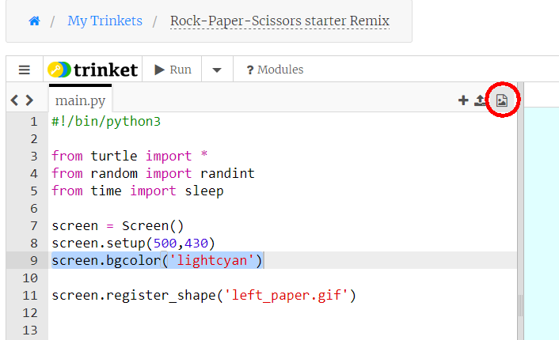
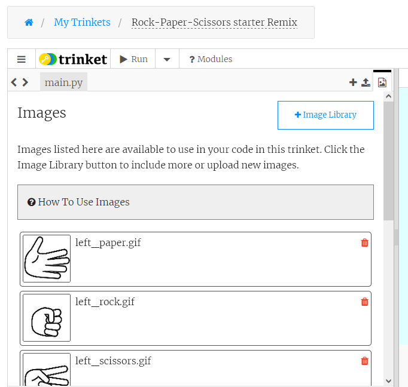

# Step 1 - Make some Turtles - trinket

Let's look at the code in the starter project:

The first line of code is

```python
#!/bin/python3
```

which tells trinket always to use Python3 commands instead of Python2 commands.

Next, we ```import``` the Python modules we need for this project:

```python
from turtle import *
from random import randint
from time import sleep
```

We need the ```turtle``` module because we are using turtles, we need the ```randint()``` function from the ```random``` module to generate random numbers and we need the ```sleep()``` function from the ```time``` module to pause the programme to build up the tension.

The next few lines all begin with the ```#``` character, so these are *comments*, which are really useful for highlighting what different bits of your code do.

The comment lines here divide the code into different sections, starting with a section for **Variables**.

The next line is a Turtle command to assign the Turtle screen to a variable called ```screen```. This is so we can give commands to the screen. The second line sets the size for the turtle screen of 450 pixels across and 400 pixels high. The third line sets the background colour of our screen to a light blue colour:

```python
screen = Screen()
setup(450,400)
screen.bgcolor('lightcyan')
```

You should now make sure your graphics area is big enough to see the complete light blue rectangle. Do this by clicking the arrow for *Run*, then drag the vertical bar between the edit panel and the Result panel from side to side until you can definitely see the right edge of the light blue colour.

We describe the final line in the starter project in the next paragraph.

### Using image files for turtle shapes

For this programme our turtles will not have the usual turtle shape, or any of the other pre-defined shapes, but will take their shapes from pictures of hands showing shapes for rock, paper and scissors.

Click on the picture icon at the top right of the edit panel:



This opens up a page where you can see the image files already in the project. You should find eight of these, if you scroll down:



To use these pictures for turtles we need to "register" the image files with the turtle *Screen*.

Click on *main.py* to return to the code. You will find the Python code to register the first image already in the starter project:

```python
screen.register_shape('left_paper.gif')
```

Now add *seven* similar lines, following the same pattern, to register the seven other images. Don't forget to put the image file names inside quotes.

### Making turtles to show your hand and the computer's

We will make two turtles, one to show ***your*** hand for rock, paper or scissors, and one to show the ***computer***'s. We will use the images of a left hand for you - the player, and the images of a right hand for the computer.

We could call these turtles ```player``` and ```computer``` but you can choose any names you like.

We will create these turtles with **two** statements like this:

```python
**** = Turtle()
**** = Turtle()
```

where you put your chosen turtle names, for you and the computer, instead of the asterisks.

We don't want to see the turtles yet, so for *both* turtles add the line

```python
****.hideturtle()
```

(again, put your turtle names instead of the stars).

We also don't want to see a line drawn when we move the turtle, so add *two* more lines like this:

```python
****.penup()
```

Now, you might know that in Python coding we try to avoid repeating code, and in the last few paragraphs we have repeated some code, just changing the names of the turtles. We can use a Python *loop* to avoid this and make our code shorter.

Keep the two lines which *create* the turtles. Then underneath  those two lines set up a ```for``` loop:

```python
for t in screen.turtles():
  t.hideturtle()
  t.penup()
```

This loop sets a variable ```t``` in turn to ***each*** of the turtles in the project (there are only two at the moment) and for each turtle it hides the turtle and sets its pen to up. Using a loop like this avoids unnecessary repetition of code. You can now **delete** any other lines with ```hideturtle()``` and ```penup()```.

One more thing - to make our game run quickly we should set all the turtles to maximum speed, so we can reposition them on the screen quickly. So ***inside the ```for``` loop*** add one more line (don't forget, this line needs to be indented):

```python
  t.speed(0)
```

To test our turtles let's try out one of the image files. Let's set *your* hand to show a rock shape. Add this line at the end (we are not in the ```for``` loop now, so these lines are *not* indented):

```python
****.shape('left_rock.gif')
****.showturtle()
```

(put the name of the turtle for you - the player's hand in place of the stars). Click on *Run*.

Oh dear, it looks as if the hand is pointing in the wrong direction. Luckily we can correct this by altering the turtle's *heading* to rotate the turtle by 90° to the left. We need to make this change to *both* turtles, so we can add this line inside the ```for``` loop:

```python
  t.setheading(90)
```

Click *Run* again, and hopefully the hand will now point in the correct direction.

At the moment the turtle is located at coordinates (0,0), which is in the middle of the screen. When we play the game we want the player's turtle left-of-centre, and the computer's turtle right-of-centre, so we can see them both.

We can change a turtle's position using the ```goto()``` method. Add this line before the ```showturtle()``` line (not indented):

```python
****.goto(?,?)
```

You will need to put the name of your player turtle in place of the stars, and an x coordinate and a y coordinate in place of the two question marks. Experiment with different x and y coordinates. You will probably find a y coordinate of 0 is ok. But remember: if you want to move a turtle left of centre you will need a negative x coordinate.

Now let's set the *computer's* hand to show the scissors shape:

```python
****.shape('right_scissors.gif')
```

Put the name of your computer turtle in place of the stars. Now add a ```goto()``` statement for the computer turtle - keep the y coordinate the same as the player turtle but make the x coordinate the same positive number as you had a negative number for the player coordinate.

Finally *show* the computer turtle using

```python
****.showturtle()
```

with the computer turtle name in place of the stars.

Test your code (click Run) and you should see the two turtles facing each other showing a different shape.

We added the last few lines to test if our code is working, but we don't need all of these for the game, so before going to the next step ***delete*** the two lines which set the shape for the two turtles, *and* the two lines which show these turtles. ***Don't delete*** the two lines with ```goto()```.

[Go to Step 2 for trinket](../Step2-Choose-the-shape-trinket)

[Go back to previous page](../README.md)

Clip art downloaded from https://www.clipart.email/download/5500085.html and edited.
