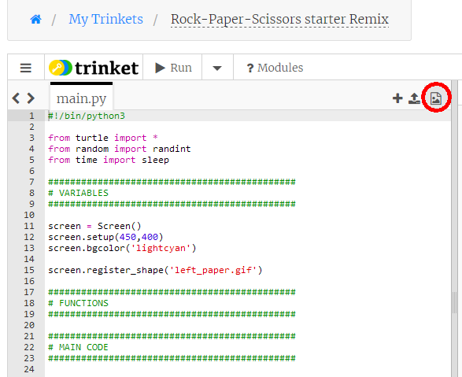

# Step 1 - Make some Turtles

Let's look at the code in the starter project:

The first line of code is

```python
#!/bin/python3
```

which tells trinket always to use Python3 commands instead of Python2 commands.

Next, we ```import``` the Python modules we need for this project:

```python
from turtle import *
from random import randint
from time import sleep
```

We need the ```turtle``` module because we are using turtles, we need the ```randint()``` function from the ```random``` module to generate random numbers and we need the ```sleep()``` function from the ```time``` module to pause the programme to build up the tension.

The next line is a Turtle command to assign the Turtle screen to a variable called ```screen```. This is so we can give commands to the screen. The second line sets the size for the turtle screen of 500 pixels across and 430 pixels high. The third line sets the background colour of our screen to a light blue colour

```python
screen = Screen()
setup(500,430)
screen.bgcolor('lightcyan')
```

You should now make sure your graphics area is big enough to see the complete light blue rectangle. Do this by clicking the arrow for *Run*, then dragging the vertical bar between the edit panel and the Result panel from side to side until you can definitely see the right edge of the light blue colour.

We describe the final line in the starter project in the next paragraph

### Using image files for turtle shapes

For this programme our turtles will not have the usual turtle shape, or any of the other pre-defined shapes, but will take their shapes from pictures of hands showing shapes for rock, paper and scissors.

Click on the picture icon at the top right of the edit panel:



To use these pictures for turtles we need to "register" the image files with the turtle Screen. Here is the Python code to do this for the first image:
```
screen.register_shape("computer_paper.gif")
```

now add five more similar lines to register the five other images.

### Making turtles for your hand and the computer's

We will make two turtles, one to show **_your_** hand for rock, paper or scissors, and one to show the computer's. We could call these turtles ```you``` and ```computer``` but you can choose any names you like.

We will create both turtles with **two** statements like this:
```
**** = Turtle()
```
where you put the turtle names instead of the stars.

We don't want to see the turtles yet, so for both turtles add the line
```
****.hideturtle()
``` 
(again, put the turtle names instead of the stars).

We also don't want to see a line drawn when we move the turtle, so add two more lines like this:
```
****.penup()
```

One more thing - to make our game run quickly we should set the turtle speeds to maximum, so we can reposition them on the screen quickly. So for each turtle add one more line:
```
****.speed(0)
```

To test our turtles let's try out some of the image files. Let's set *your* hand to show a rock shape. Add the line
```
****.shape("you_rock.gif")
```
(put the name of the turtle for your hand in place of the stars). Now let's set the *computer's* hand to show the scissors shape:
```
****.shape("computer_scissors.gif")
```

If you look at the six images you will see that the three that have filenames beginning with "you" show a hand coming from the left, and the three that have filenames beginning with "computer" show a hand coming from the right. You should be able to work out that we want to put the "you" turtle somewhere left of the centre of the screen and the "computer" turtle somewhere to the right of the centre.

Add these lines for **each** turtle, using the appropriate turtle name instead of the stars:
```
****.goto(?,?)
****.showturtle()
```
What do you put in place of the question marks? These will be x and y coordinates for the position where the turtle will appear.  

To help you choose suitable coordinates for your hand and for the computer's here is a picture showing how the coordinates look on a turtle window of the size we have set:

 

Once you have selected your coordinates for the two turtles save your code and run it. If you're not happy with the positions adjust the coordinates until the positions of the turtles looks good.

>### Special Note if you are writing your code with the *Visual Studio Code* editor:
>
>With Visual Studio Code you will find that the Turtle window opens and closes again immediately, so you don't have a chance to see what is in the window. To stop this happening you need to add a line at the *bottom* of your code which says
>```
>mainloop()
>```
>This will keep the turtle window open. Make sure this line is always the *last* line in your code - don't put any lines of code after this.
>
>If you are using the IDLE editor _*YOU DO NOT NEED THIS LINE OF CODE*_.

Now we're almost ready to start coding the game.

Before that we can make the code smarter, and avoid a lot of extra typing in the rest of the game.

[Making the code smarter](README2.md)

Clip art downloaded from https://www.clipart.email/download/5500085.html and edited.
