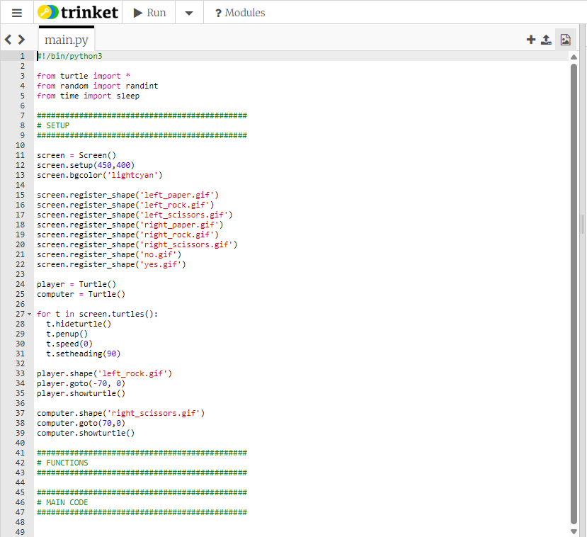

# Example code for the end of step 1



In this example the player's turtle is called ```player``` and the computer's turtle is called ```computer```, but you might have chosen different names for your turtles.

Click [here](README.md/#check-your-code) to return to instructions.