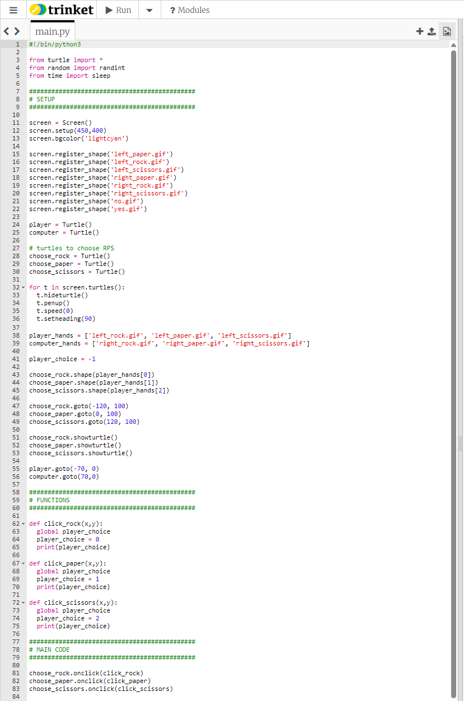

# Example code for the end of step 2



The **SETUP** part of the code makes all the turtles, sets their positions and pen and other parameters.

It also creates two *lists* of image files to be used for different hand shapes and then sets the hand images for the three "choose" turtles (by taking images files from the lists) and shows these three turtles.

The **MAIN CODE** part of the code specifies which functions should be run if any of the choose turtles are clicked.

The **FUNCTIONS** part of the code contains the functions which will run when the choose turtles are clicked. These functions will set the value of a variable called ```player_choice```: it will have value 0 if the player clicks the ```choose_rock``` turtle; 1 if the player clicks the ```choose_paper``` turtle and 2 if the player clicks the ```choose_scissors``` turtle.

Click [here](README.md/#check-your-code) to return to instructions.
