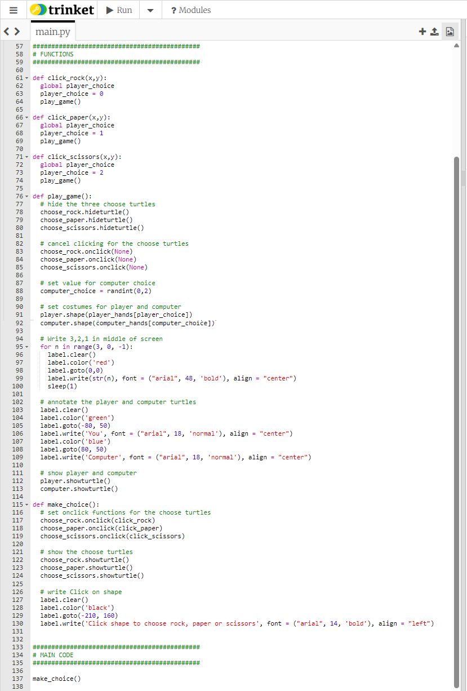

# Example code for the end of step 3



The SETUP section is the same as for step 2 *except* that we have created one more turtle, called ```label```. (Note, this must be created *before* the ```for``` loop so that it will have all the settings in the ```for``` loop applied to it.)


Click [here](README.md/#code-check) to return to instructions.
